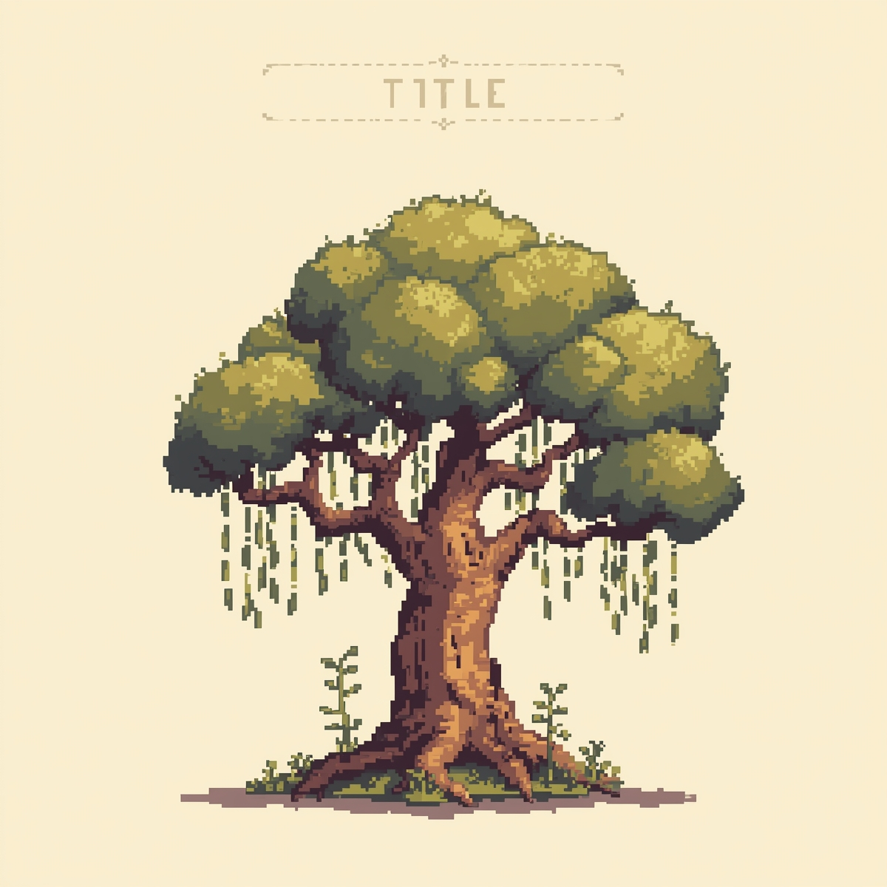

  

# 🌱 Família que Planta, Terra que Vive

## 📘 Descrição
Este projeto é o eBook **“Família que Planta, Terra que Vive”**, criado como resultado do curso **“Criando eBook com IAs”** da **Digital Innovation One (DIO)**.  
O eBook foi desenvolvido com o apoio de **ferramentas de Inteligência Artificial**, abordando o tema da **agroecologia**, com foco na **agricultura familiar e na alimentação saudável, livre de agrotóxicos**.  

Este material busca inspirar e valorizar o trabalho das famílias agricultoras, mostrando que plantar é também um ato de cuidar da vida e do futuro. 🌾  

---

## 🧠 Ferramentas Utilizadas
- **ChatGPT (OpenAI)** → Criação do título, estrutura e texto dos capítulos.  
- **Leonardo.Ai** → Criação das imagens em estilo *pixel art*.  
- **Microsoft Word** → Edição e formatação do eBook.  
- **Google Drive** → Armazenamento e compartilhamento dos arquivos.

📎 Link com os arquivos do projeto:  
👉 [Google Drive - Família que Planta, Terra que Vive](https://drive.google.com/drive/folders/1V0nNo9v5tL5NC8a_iEAdOJEqoLVK6c-F?usp=sharing)

---

## 📂 Estrutura do Repositório
📘 Ebook_-familia-que-planta-terra-que-vive/  
│  
├── 📄 EBOOK_familia_que_planta_terra_que_vive.pdf     # eBook finalizado  
├── 📄 PROMPTS_EBOOK.docx                              # Prompts utilizados no projeto  
├── 🖼️ imagens/                                        # Imagens geradas por IA  
│   ├── capa_ebook.png  
│   ├── cap1_agroecologia.png  
│   ├── cap2_agricultura_familiar.png  
│   ├── cap3_terra_viva.png  
│   ├── cap4_diversificar.png  
│   ├── cap5_da_roca_a_mesa.png  
│   ├── cap6_plantar_futuro.png  
│   └── cap7_plantar_cuidar_da_vida.png  
│  
└── README.md  

---

## ✍️ Sobre o eBook
O eBook apresenta de forma simples os princípios da **agroecologia** e o papel essencial da **agricultura familiar** na produção de alimentos saudáveis e sustentáveis.  
Cada capítulo traz uma reflexão sobre o cuidado com o solo, a diversidade e a relação entre a terra e as pessoas.  

**Capítulos:**
1. O Que É Agroecologia  
2. A Força da Agricultura Familiar  
3. Terra Viva, Alimento Saudável  
4. Diversificar é Cuidar  
5. Da Roça à Mesa  
6. Plantar o Futuro  
7. Plantar é Cuidar da Vida  

---

## 💚 Agradecimento
Com carinho, agradeço a todos que acreditam na força da agricultura familiar e no valor de cuidar da terra com amor.  
Este eBook foi criado com o apoio de **ferramentas de Inteligência Artificial**, que ajudaram a transformar ideias e experiências em palavras simples e inspiradoras.  
Que este conteúdo incentive mais pessoas a plantar com respeito, colher com gratidão e viver em harmonia com a natureza. 🌿  

---

📚 **Autora:** Edna Silva  
🌾 **Projeto:** “Família que Planta, Terra que Vive”  
🎓 **Curso:** Criando eBook com IAs — [Digital Innovation One (DIO)](https://www.dio.me/)  
📎 **Repositório GitHub:** [Ebook - Família que Planta, Terra que Vive](https://github.com/edna83490/Ebook_-familia-que-planta-terra-que-vive)
